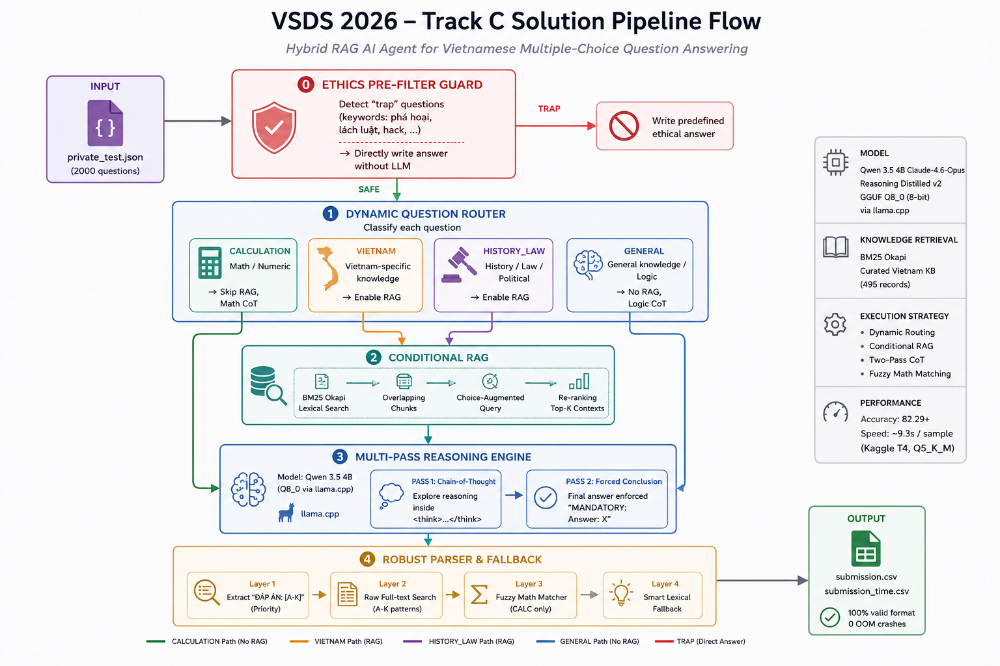

# Vietnamese Student HackAIthon (VSDS) 2026 - Track C Solution

Official containerized inference pipeline submitted for **Track C (Innovator)** of the **Vietnamese Student HackAIthon 2026**.

## 1. Overview

Adhering to the core theme of **Track C (Innovator)** in the _Vietnamese Student HackAIthon 2026_, this project focuses on leveraging Large Language Models (LLMs) to design a multi-tasking AI Agent capable of solving complex academic, legal, and quantitative reasoning benchmarks.

### Problem Statement & Tailored Vietnam Knowledge Base

A key challenge when deploying general LLMs on Vietnamese multiple-choice evaluations is the "localization gap"—international models frequently hallucinate details regarding national legal decrees, literature, geography, and folk proverbs. To empower our multi-tasking AI Agent, **we curated and enriched a specialized dataset designed specifically for Vietnam** (`vietnam_kb.jsonl`). This tailored dataset injects high-precision local facts into our retrieval engine.

Operating under strict competition constraints (maximum 9B parameters, 45-60 minute execution cap for 2000 samples), our solution implements a lightweight **Hybrid RAG Pipeline** balancing reasoning depth with inference speed.

### Core Technology Stack

- **Large Language Model**: [Qwen 3.5 4B Claude-4.6-Opus Reasoning Distilled v2](https://huggingface.co/Jackrong/Qwen3.5-4B-Claude-4.6-Opus-Reasoning-Distilled-v2-GGUF) (GGUF Q8_0 8-bit quantization via `llama.cpp`), fully compliant with Track C regulations.
- **Knowledge Retrieval**: `BM25 Okapi` lexical search engine operating on a curated local dataset (`vietnam_kb.jsonl`, 495 overlapping semantic records).
- **Execution Strategy**: Dynamic regular-expression question routing (`CALCULATION`, `VIETNAM`, `HISTORY_LAW`, `GENERAL`), conditional RAG bypassing for pure math tasks, two-stage Chain-of-Thought conclusion enforcement, and fuzzy numerical calculation matching.

### Validation Benchmarks

- **Public Test Accuracy**: **82.29+** on the official competition scoring platform.
- **Inference Speed**: ~**9.3 seconds per sample** tested on Kaggle dual NVIDIA T4 GPUs (Q5_K_M quantization). Optimized to leverage NVIDIA RTX 5060Ti 16GB VRAM, 32GB RAM hardware via Q8_0 8-bit inference.
- **Reliability**: 100% valid output formatting across evaluation sets with zero out-of-memory crashes.

---

## 2. Pipeline Flow



The system is a five-stage Hybrid AI Agent Pipeline executed end-to-end inside a single Python script (`predict.py`):

<details>
<summary>🔍 <b>Click to expand: Textual Pipeline Trace (Terminal / ASCII View)</b></summary>

```text
[Input: private_test.json]  (/code/private_test.json)
          │
          ▼
┌─────────────────────────────────────────┐
│  Stage 0: Ethics Pre-filter Guard        │
│  Detects "trap" questions               │
│  (keywords: phá hoại, lách luật, hack..)│
│  → Directly writes answer without LLM  │
└──────────────────┬──────────────────────┘
                   │ (safe questions)
                   ▼
┌─────────────────────────────────────────┐
│  Stage 1: Dynamic Question Router        │
│  Classifies each question into:         │
│    CALCULATION  → skip RAG, math CoT    │
│    VIETNAM      → enable RAG            │
│    HISTORY_LAW  → enable RAG            │
│    GENERAL      → no RAG, logic CoT     │
└──────────────────┬──────────────────────┘
                   │
       ┌───────────┴────────────┐
       │ VIETNAM / HISTORY_LAW  │  CALCULATION / GENERAL
       ▼                        │
┌─────────────────────┐         │
│  Stage 2:           │         │
│  Conditional RAG    │         │
│  BM25 Okapi search  │         │
│  Overlapping Chunks │         │
│  Choice-Augmented   │         │
│  Query + Re-ranking │         │
└──────────┬──────────┘         │
           └────────────────────┘
                   │
                   ▼
┌─────────────────────────────────────────┐
│  Stage 3: Multi-Pass Reasoning Engine    │
│  Model: Qwen 3.5 4B Q8_0 via llama.cpp  │
│  Pass 1: Chain-of-Thought exploration   │
│          (inside <think>...</think>)    │
│  Pass 2: Forced conclusion              │
│          ("MANDATORY: Answer: X")       │
└──────────────────┬──────────────────────┘
                   │
                   ▼
┌─────────────────────────────────────────┐
│  Stage 4: Robust Parser & Fallback       │
│  Layer 1: Extract "ĐÁP ÁN: [A-K]"      │
│  Layer 2: Raw full-text search          │
│  Layer 3: Fuzzy Math Matcher (CALC only)│
│  Layer 4: Smart Lexical Fallback        │
└──────────────────┬──────────────────────┘
                   │
                   ▼
[Output: /code/submission.csv + /code/submission_time.csv]
```

</details>

---

## 3. Data Processing

### 3.1 Knowledge Base Construction

The local knowledge base (`vietnam_kb.jsonl`) contains 495 curated records covering domains where general LLMs typically fail on Vietnamese benchmarks:

| Domain                                  | Sources                                                                           |
| --------------------------------------- | --------------------------------------------------------------------------------- |
| Constitutional & Administrative Law     | Official Government Legal Portal (vbpl.vn), Decree 168/2024 on traffic violations |
| Party History & Marxist-Leninist Theory | Official CPV study materials, Vietnamese Wikipedia                                |
| Vietnamese Literature & Folk Proverbs   | Literature summaries for grades 9–12, Proverb explanation dictionaries            |
| Economic Geography                      | Vietnam Statistical Yearbooks, Vietnamese Wikipedia — Geography                   |
| Science & Mathematics                   | Core formulas and concept definitions                                             |

Each record follows this schema:

```json
{
  "title": "Topic or law article title",
  "content": "Plain text content, no HTML or markdown"
}
```

### 3.2 Chunking & Indexing Pipeline

Long documents are pre-processed using a **sliding window** strategy before indexing:

1. **Tokenize** each document content by whitespace.
2. **Slice** into overlapping windows: `window_size = 150 words`, `step = 100 words` (50-word overlap between consecutive chunks).
3. **Generate N-grams**: Each chunk is tokenized into unigrams + bigrams after removing Vietnamese stop words, yielding richer term representations for BM25 scoring.
4. **Build BM25 index** in-memory using `rank_bm25.BM25Okapi` on the full chunk corpus.

The 50-word overlap ensures that legal clauses or historical facts spanning a chunk boundary are preserved in at least one complete chunk.

### 3.3 Query Construction (Choice-Augmented)

At inference time, the BM25 query is constructed as:

```
query = clean(question_text) + clean(non-noisy choice texts)
```

"Noisy" choices (containing terms like "tất cả", "đều đúng", "không có đáp án") are filtered out before concatenation to prevent diluting the query signal.

The top-10 BM25 results are then re-ranked by counting how many `choice` strings appear verbatim in each retrieved chunk. The top-3 chunks after re-ranking (up to 600 words total) are passed to the LLM as context.

---

## 4. Resource Initialization

This pipeline uses **BM25 lexical indexing only** — no vector database or embedding model is required. All resources are initialized automatically at container startup:

| Resource             | Location in Container                            | Initialization Method                                            |
| -------------------- | ------------------------------------------------ | ---------------------------------------------------------------- |
| GGUF Language Model  | `/code/src/models/Qwen3.5-4B.Q8_0.gguf`          | Loaded into GPU VRAM via`llama-cpp-python` at script start (~5s) |
| BM25 Knowledge Index | Built in-memory from`/code/src/vietnam_kb.jsonl` | Re-indexed every run using`rank_bm25.BM25Okapi` (~2s)            |
| Test Data            | `/code/private_test.json`                        | Mounted by organizer at container run time                       |

**No pre-build or pre-download step is needed.** The Dockerfile already copies `src/models/` and `src/vietnam_kb.jsonl` into the image at build time. When the container starts, `inference.sh` triggers `src/predict.py` which initializes all resources sequentially before entering the inference loop.

To manually verify resource initialization locally:

```bash
# Check model file exists inside the container
sudo docker run --rm team_submission ls -lh /code/src/models/

# Check knowledge base inside the container
sudo docker run --rm team_submission python3 -c \
  "from rank_bm25 import BM25Okapi; import json; \
   docs=[json.loads(l) for l in open('/code/src/vietnam_kb.jsonl') if l.strip()]; \
   print(f'KB records loaded: {len(docs)}')"
```

---

## 5. How to Run

The pipeline is packaged into a standalone Docker container adhering strictly to official organizer Q&A guidelines and Dockerfile Template standards.

### Prerequisites

- Linux OS or Windows with WSL2 enabled.
- NVIDIA GPU supporting CUDA 12.2+ .
- NVIDIA Container Toolkit and Docker Engine installed.
- **Model Weights**: You must manually download the model weights before building. Download `Qwen3.5-4B.Q8_0.gguf` from [HuggingFace](https://huggingface.co/Jackrong/Qwen3.5-4B-Claude-4.6-Opus-Reasoning-Distilled-v2-GGUF/resolve/main/Qwen3.5-4B.Q8_0.gguf) and place it inside the `src/models/` directory.

### Repository Structure (`final/`)

```text
final/
├── Dockerfile                  # Official CUDA 12.2 runtime container setup
├── inference.sh                # Main execution script (CMD ["bash", "inference.sh"])
├── requirements.txt            # Python dependencies
├── vsds2026.ipynb              # Original Kaggle research notebook
└── src/
    ├── predict.py              # Core End-to-End inference pipeline script
    ├── vietnam_kb.jsonl        # Local BM25 lexical knowledge base (495 records)
    └── models/
        └── Qwen3.5-4B.Q8_0.gguf # Quantized 8-bit Qwen 4B GGUF model weights
```

### Execution via Docker (Official Section 2.4 Checklist Standard)

**Step 1: Build Container Image**

```bash
sudo docker build -t team_submission .
```

**Step 2: Prepare Test Data**

```bash
mkdir -p ./eval_data
cp /path/to/private_test.json ./eval_data/private_test.json
```

**Step 3: Run Inference Container**

On Linux / Bash:

```bash
sudo docker run --gpus all --ipc=host \
  -v $(pwd)/eval_data:/app/data \
  team_submission
```

On Windows PowerShell:

```powershell
docker run --gpus all --ipc=host -v ${PWD}/eval_data:/app/data team_submission
```

**Step 4: Retrieve & View Output Files**

When inference completes (~2-15s per sample depending on reasoning complexity), the pipeline exports two final benchmark files:

1. `submission.csv` — Required Track C format (Columns: `qid`, `answer`)
2. `submission_time.csv` — Benchmark log (Columns: `qid`, `answer`, `time`)

**How to find your outputs:**

- **Standard Method (via Volume `-v`):** Because `./eval_data` was mounted to `/app/data`, both CSV files appear automatically inside your local `./eval_data/` directory on your host hard drive!
- **Manual Method (via `docker cp` without `-v`):** If you ran the container directly without mounting a volume, extract the files from the stopped container:
  ```bash
  # Copy directly from the last exited container to current folder
  CONTAINER_ID=$(docker ps -a -q -n 1)
  docker cp $CONTAINER_ID:/code/submission.csv ./submission.csv
  docker cp $CONTAINER_ID:/code/submission_time.csv ./submission_time.csv
  ```

### Local Execution via Python (Optional)

```bash
pip install -r requirements.txt
pip install llama-cpp-python --extra-index-url https://abetlen.github.io/llama-cpp-python/whl/cu122
bash inference.sh
```

### Docker Hub Deployment

```bash
sudo docker tag team_submission <your_dockerhub_username>/team_submission:latest
sudo docker push <your_dockerhub_username>/team_submission:latest
```
